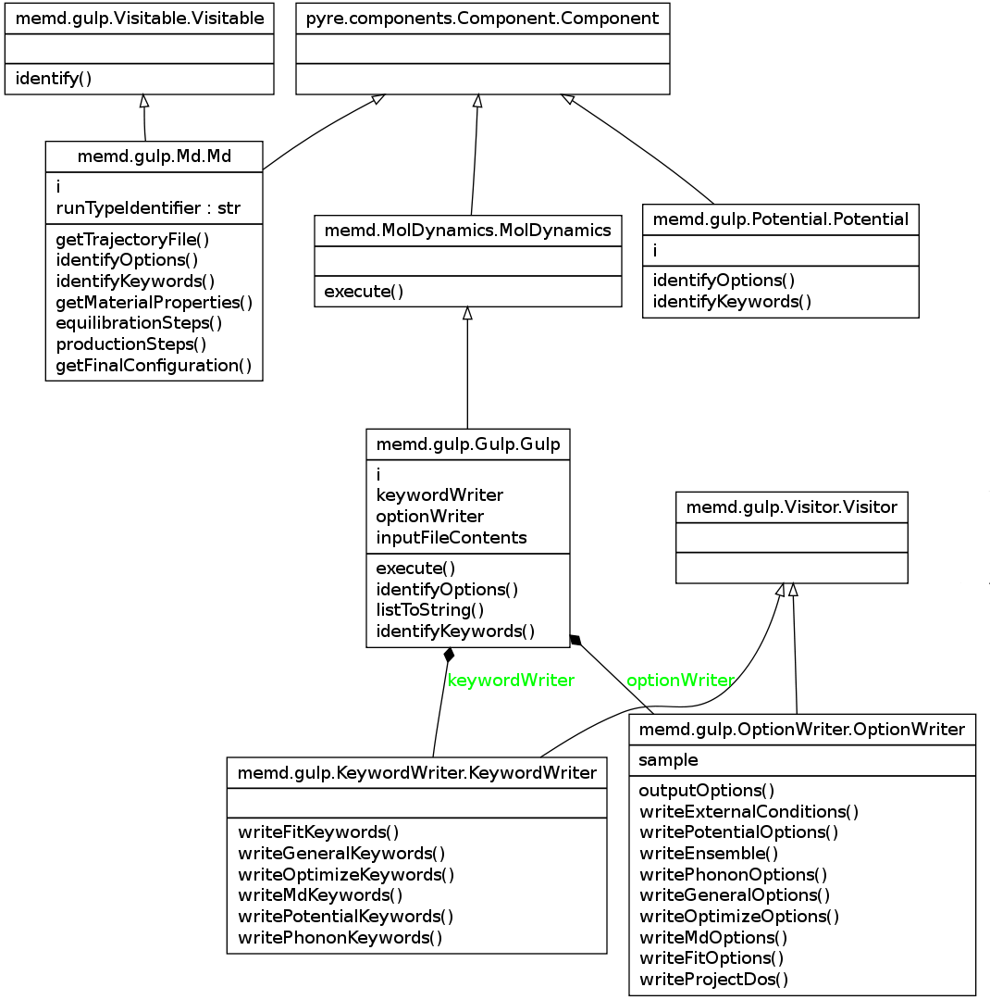

.. index:: structure

Introduction
============

AtomSim uses the package namespace "memd" in its Python scripting layer, which stands for Multi-Engine MD. As a pyre 0.8 application, individual parts of the application inherit from the pyre Component class.  For example, using the Gulp engine and md workflow as an example:

shows the Gulp settings, the Md runtype, and Potential class all inherit from pyre.components.Component.Component.  This allows users to configure all settings of memd easily from the command line::

	memd.py --engine=gulp --gulp.runType=md ...

As explained in the `pyre documentation <http://docs.danse.us/pyre/sphinx/>`_ , pyre applications may also be configured via xml files.  Please see the :ref:`tutorial` for detailed instructions on how to do this and an exploration of some of the scripting workflows available in memd. 